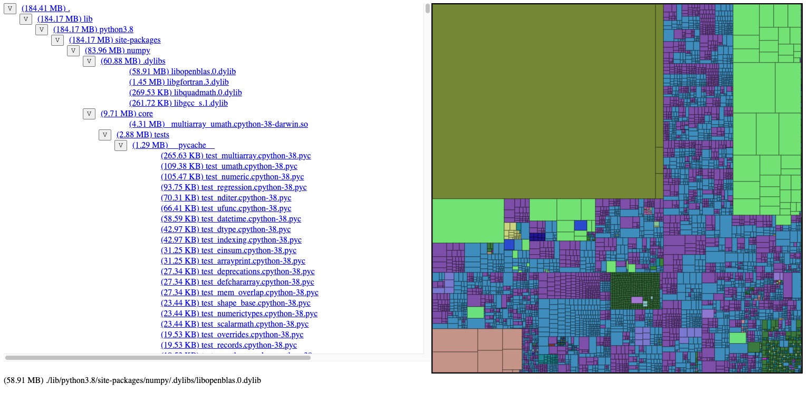

# whaler

[](https://pypi.org/project/whaler)
[](https://pypi.org/project/whaler)

**What?** A command-line tool for visually investigating the disk usage of docker images

**Why?** Large images are slow to move and expensive to store. They cost developer productivity by lengthening devops tasks and often contain unnecessary data

**Who is this for?** Primarily for engineers working with images containing Python packages.

## User Stories

This tool should allow you to answer questions such as:
1. Which file types are occupying the most disk space?
2. Which are my largest Python packages?
3. What are my unknown causes of high disk usage?

## Quick start

```bash
pip install whaler
```

### Run against a local directory
```
➜ whaler .venv
Running bash -c cd .venv && du -a -k
Done. Serving output at http://localhost:8000 (ctrl+c to exit)
Running python3 -m http.server 8000 --directory=_whaler/html
```

### Run against a docker image

The tool will pull the image first if it is not present.
```
whaler --image='hl:latest' /
Running docker run --rm --entrypoint=du --workdir=/ hl:latest -a -k
Ignoring what seems to be non-fatal error(s):
du: cannot access './proc/1/task/1/fd/4': No such file or directory
du: cannot access './proc/1/task/1/fdinfo/4': No such file or directory
du: cannot access './proc/1/fd/3': No such file or directory
du: cannot access './proc/1/fdinfo/3': No such file or directory


Done. Serving output at http://localhost:8000 (ctrl+c to exit)
Running python3 -m http.server 8000 --directory=_whaler/html
```

Done. Serving output at http://localhost:8000 (ctrl+c to exit)
Running python3 -m http.server 8000 --directory=_whaler/html




## Limitations

1. Platform: whaler uses `du` to gather disk usage data. It must be present in your docker image
2. Scale: I have tested the web UI with up to 500,000 file system nodes with `du` output of up to ~100MB.

## Alternatives/Complements to this tool:

1. Whaler can tell you what is taking up space in the final layer of your Docker image, but you may have intermediate layers which are contributing to the image size. For diving through the layers, use [dive](https://github.com/wagoodman/dive)
    * **Related**: read up on [multi-stage builds](https://docs.docker.com/develop/develop-images/multistage-build/) to understand how to mitigate the problem of intermediate layers bloating your image.
1. For investigating disk usage in non-docker directories, [Disk Inventory X](http://www.derlien.com/) is a great tool on OS X which I have based whaler on.

## Developing

See `.github/workflows/test.yml` for the development platform and setup.

For UI, see [whaler-ui](https://github.com/treebeardtech/whaler-ui)